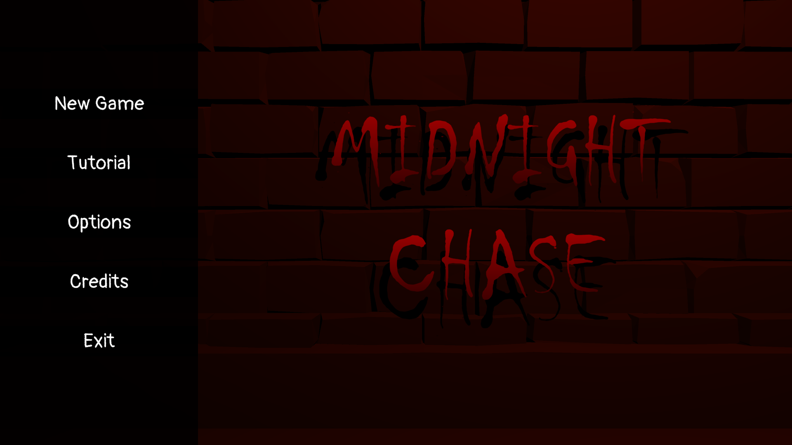
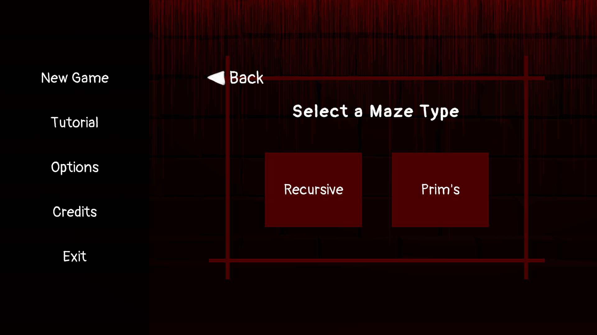
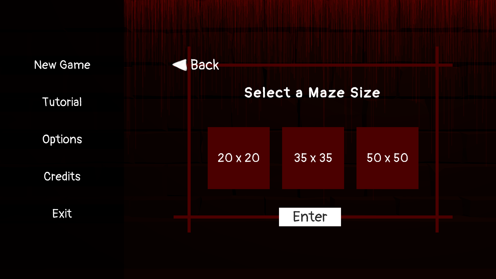
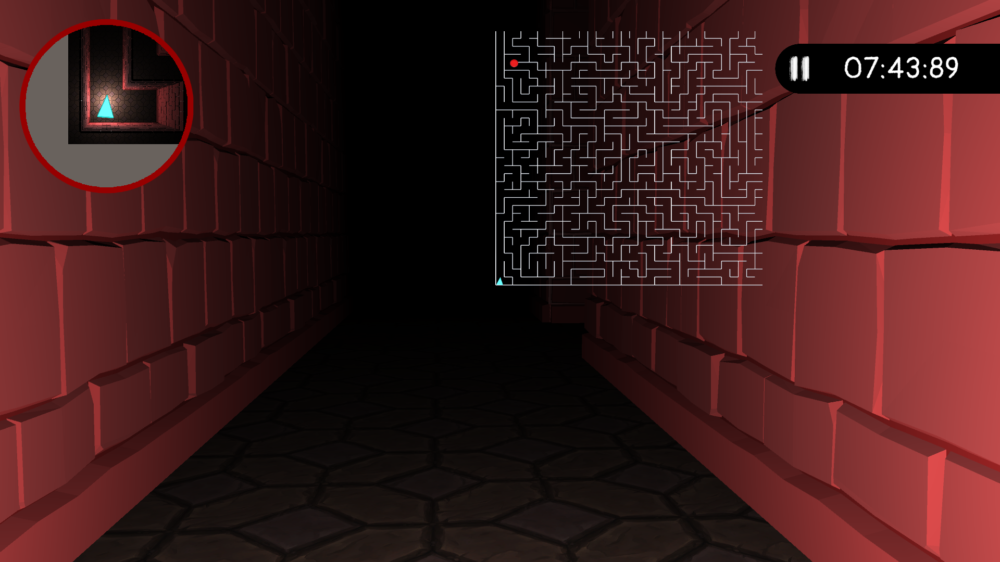

# Midnight Chase 🎮 (A 3D Maze Game)

## 📝 Overview
A 3D maze game helping to improve NPC movement by testing a modified pathfinding AI against a moving target across different 3D maps generated by two different algorithms. It consists of 2 maze types (Recursive and Prims), and each maze type has 3 different size variations (20x20, 35x35, 50x50) to choose from. This project was made in accordance to Thesis I and II.

## 🚀 Gameplay Features
- Maze exploration with time limitations
- Map guide (mini map and full map)
- Enemy AI player detection
- Full gameplay with audio

## 🎥 Gameplay Previews

### Main Menu

### Gameplay

### Maze Type

### Maze Size

### In-Game Environment

## ▶ How to Run

1. Download the `.zip` file from the **Releases** section.  
2. Extract the folder.  
3. Run `MidnightChase.exe`.  
4. If Windows flags it as unknown, select **Run anyway**.

## 📦 Credits

Assets used are from free resources (Itch.io, Freesound.org, Unity Assets Store and various public asset sources).  
Full author list included in:  
📄 *[Credits File](media/credits.txt)*

This project is for learning and non-commercial use.

## 👤 Contribution

All scripting, scene setup, algorithm implementation, character and enemy animation implementation, gameplay implementation, UI logic, bug fixing, and system integration were done by the group.
